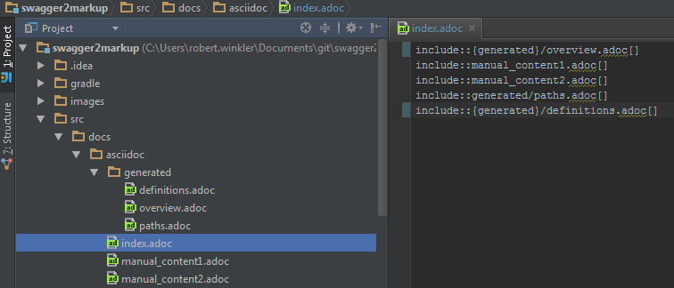
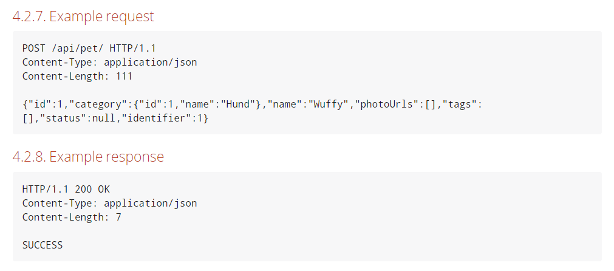

== Using Swagger2Markup

=== Generate Markup from local Swagger file

Using Swagger2Markup is simple.

[source,java]
----
public class Swagger2MarkupTest {

    @Test
    public void convertLocalSwaggerToAsciiDoc() {
        //Local Swagger source
        //Default is AsciiDoc
        String location = Swagger2MarkupTest.class.getResource("/json/swagger.json").getPath();
        Swagger2MarkupConverter.from(location) // <1>
          .withMarkupLanguage(MarkupLanguage.ASCIIDOC) // <2>
          .build() // <3>
          .intoFolder("src/docs/asciidoc/generated"); // <4>

        // Then validate that three AsciiDoc files have been created
        String[] files = new File("src/docs/asciidoc/generated").list();
        assertThat(files).hasSize(3)
            .containsAll(Arrays.asList("overview.adoc", "paths.adoc", "definitions.adoc")); // <5>
    }
}
----
<1> Create a `Swagger2MarkupConverter.Builder` by specifying the source location (which can be any absolute file path)
<2> Specify the Markup language you want to use (ASCIIDOC is the default Markuplanguage)
<3> Build an instance of the `Swagger2MarkupConverter`
<4> Invoke the `intoFolder` method by specifying the output directory
<5> By default the `Swagger2MarkupConverter` creates three files: _overview.adoc_, _paths.adoc_ and _definitions.adoc_

=== Generate Markup during an integration test

If you are using https://github.com/spring-projects/spring-boot[Spring Boot] and https://github.com/springfox/springfox[springfox] or https://github.com/swagger-api/swagger-core/wiki/Swagger-Core-JAX-RS-Project-Setup-1.5.X[Swagger JAX-RS], you can generate your Swagger JSON file during the integration or unit test phase, convert the Swagger JSON file into AsciiDoc, convert AsciiDoc into HTML and PDF, copy the documentation into the Jar file and serve it as static content. That way there is no runtime overhead and there are no additional runtime libraries required.
The quickest way to get started is to look at the demo project https://github.com/Swagger2Markup/spring-swagger2markup-demo[spring-swagger2markup-demo]. The demo shows how to generate static docs (HTML5 and PDF) with the https://github.com/Swagger2Markup/swagger2markup-gradle-plugin[Swagger2Markup Gradle Plugin] and serve them as static content in a Spring Boot App under http://localhost:9080/docs/index.html and http://localhost:9080/docs/index.pdf.

The Swagger2MarkupConverter can be used to make a request to a remote Swagger endpoint during an integration test. The Swagger2MarkupConverter writes the generated documents into the folder `src/docs/asciidoc/generated` or `src/docs/markdown/generated`.

[source,java]
----
@RunWith(SpringJUnit4ClassRunner.class)
@SpringApplicationConfiguration(classes = Application.class)
@IntegrationTest
@WebAppConfiguration
public class Swagger2MarkupTest {

    @Test
    public void convertRemoteSwaggerToAsciiDoc() {
        // Remote Swagger source
        // Default is AsciiDoc
        Swagger2MarkupConverter.from("http://localhost:8080/v2/api-docs").build()
            .intoFolder("src/docs/asciidoc/generated");

        // Then validate that three AsciiDoc files have been created
        String[] files = new File("src/docs/asciidoc/generated").list();
        assertThat(files).hasSize(3)
            .containsAll(Arrays.asList("definitions.adoc", "overview.adoc", "paths.adoc"));
    }

    @Test
    public void convertRemoteSwaggerToMarkdown() {
        // Remote Swagger source
        // Markdown
        Swagger2MarkupConverter.from("http://localhost:8080/v2/api-docs")
            .withMarkupLanguage(MarkupLanguage.MARKDOWN).build()
            .intoFolder("src/docs/markdown/generated");

        // Then validate that three Markdown files have been created
        String[] files = new File("src/docs/markdown/generated").list();
        assertThat(files).hasSize(3)
            .containsAll(Arrays.asList("definitions.md", "overview.md", "paths.md"));
    }
}
----

=== Generate Markup during an unit test with springfox-staticdocs

Spring's MVC Test framework can also be used to make a request to a https://github.com/springfox/springfox[springfox] Swagger endpoint during an unit test. A custom ResultHandler `Swagger2MarkupResultHandler` is used to automatically convert the Swagger JSON response into an AsciiDoc document. The custom ResultHandler is part of `springfox-staticdocs`. That way you also verify that your Swagger endpoint is working.

[source,java]
----
@WebAppConfiguration
@RunWith(SpringJUnit4ClassRunner.class)
@ContextConfiguration(classes = Application.class, loader = SpringApplicationContextLoader.class)
public class Swagger2MarkupTest {

    @Autowired
    private WebApplicationContext context;

    private MockMvc mockMvc;

    @Before
    public void setUp() {
        this.mockMvc = MockMvcBuilders.webAppContextSetup(this.context).build();
    }

    @Test
    public void convertSwaggerToAsciiDoc() throws Exception {
        this.mockMvc.perform(get("/v2/api-docs")
                .accept(MediaType.APPLICATION_JSON))
                .andDo(Swagger2MarkupResultHandler
                    .outputDirectory("src/docs/asciidoc/generated").build())
                .andExpect(status().isOk());
    }

    @Test
    public void convertSwaggerToMarkdown() throws Exception {
        this.mockMvc.perform(get("/v2/api-docs")
                .accept(MediaType.APPLICATION_JSON))
                .andDo(Swagger2MarkupResultHandler.outputDirectory("src/docs/markdown/generated")
                    .withMarkupLanguage(MarkupLanguage.MARKDOWN).build())
                .andExpect(status().isOk());
    }
}
----

==== Springfox Gradle configration

[source,groovy]
----
dependencies {
    ...
    compile 'io.springfox:springfox-swagger2:2.0.3'
    testCompile 'io.springfox:springfox-staticdocs:2.0.3'
    ...
}
----

==== Springfox Maven configuration

```xml
<dependency>
	<groupId>io.springfox</groupId>
	<artifactId>springfox-swagger2</artifactId>
	<version>2.0.3</version>
</dependency>
<dependency>
	<groupId>io.springfox</groupId>
	<artifactId>springfox-staticdocs</artifactId>
	<version>2.0.3</version>
	<scope>test</scope>
</dependency>
```

==== Springfox configuration

The following is a complete https://github.com/springfox/springfox[springfox] configuration to use Swagger in a Spring Boot Application.

[source,java]
----
@SpringBootApplication
@EnableSwagger2
public class Application {

    public static void main(String[] args) {
        SpringApplication.run(Application.class, args);
    }

    @Bean
    public Docket restApi() {
        return new Docket(DocumentationType.SWAGGER_2)
                .apiInfo(apiInfo())
                .select()
                .paths(ant("/api/**"))
                .build();
    }

    private ApiInfo apiInfo() {
        return new ApiInfoBuilder()
                .title("Petstore API Title")
                .description("Petstore API Description")
                .contact("Petstore API Contact Email")
                .version("1.0.0")
                .build();
    }
}
----

=== Combine generated documentation with your hand-written documentation

The following shows how you can combine the generated documentation with your hand-written AsciiDoc documentation. You have to create an `index.adoc` (it must not be necessarily called index). To include the programmatically generated snippets in your documentation, you use Asciidoc's `include` macro. The `generated` variable is configured below.



You can generate your HTML5 and PDF documentation via the https://github.com/asciidoctor/asciidoctor-gradle-plugin[asciidoctor-gradle-plugin] or https://github.com/asciidoctor/asciidoctor-maven-plugin[asciidoctor-maven-plugin]. The following listing shows how to configure the Asciidoctor Gradle plugin. By default it searches for AsciiDoc files in `src/docs/asciidoc` and puts the HTML and PDF output into `build/asciidoc/html5` and `build/asciidoc/pdf`. The `generated` attribute is used to replace the variable in the `index.adoc` file and to provide configurable access to the generated snippets.

==== Asciidoctor Gradle configuration

[source,groovy]
----
ext {
    generatedDocumentation = file('src/docs/asciidoc/generated')
}

test {
    outputs.dir generatedDocumentation
}

asciidoctor {
    dependsOn test
    sources {
        include 'index.adoc'
    }
    backends = ['html5', 'pdf']
    attributes = [
            doctype: 'book',
            toc: 'left',
            toclevels: '2',
            numbered: '',
            sectlinks: '',
            sectanchors: '',
            generated: generatedDocumentation
    ]
}
----

==== Asciidoctor Maven configuration

[source,xml]
----
<plugin>
	<groupId>org.asciidoctor</groupId>
	<artifactId>asciidoctor-maven-plugin</artifactId>
	<version>1.5.2</version>
	<executions>
		<execution>
			<id>generate-docs</id>
			<phase>package</phase>
			<goals>
				<goal>process-asciidoc</goal>
			</goals>
			<configuration>
				<backend>html</backend>
				<attributes>
					<toclevels>2</generated>
					<toc>left</generated>
					<doctype>book</generated>
					<generated>src/docs/asciidoc/generated</generated>
				</attributes>
			</configuration>
		</execution>
	</executions>
</plugin>
----

You can copy the output into your Jar file and serve the documentation as static content under `http://localhost:9080/docs/index.html` and `http://localhost:9080/docs/index.pdf`.

==== Gradle configuration

[source,groovy]
----
jar {
    dependsOn asciidoctor
    from ("${asciidoctor.outputDir}/html5") {
        into 'static/docs'
    }
    from ("${asciidoctor.outputDir}/pdf") {
        into 'static/docs'
    }
}
----

==== Maven configuration

[source,xml]
----
<plugin>
	<artifactId>maven-resources-plugin</artifactId>
	<version>2.7</version>
	<executions>
		<execution>
			<id>copy-resources</id>
			<phase>prepare-package</phase>
			<goals>
				<goal>copy-resources</goal>
			</goals>
			<configuration>
				<outputDirectory>${project.build.outputDirectory}/static/docs</outputDirectory>
				<resources>
					<resource>
						<directory>${project.build.directory}/asciidoc/html5</directory>
					</resource>
				</resources>
			</configuration>
		</execution>
	</executions>
</plugin>
----

=== Create separated definition files

If you want to create, in addition to the definitions.adoc, separate definition files for each model (ex: person.adoc, address.adoc, purchase.adoc ...), you can do the following:

[source, java]
----
Swagger2MarkupConverter.from("http://localhost:8080/v2/api-docs")
    .withSeparatedDefinitions().build()
    .intoFolder("src/docs/asciidoc/generated");

// Then validate that separated definition files have been created
assertThat(directories).hasSize(8).containsAll(
            asList("definitions.adoc", "overview.adoc", "paths.adoc",
                "user.adoc", "category.adoc", "pet.adoc", "tag.adoc", "order.adoc"));
----

=== Include spring-restdocs example snippets

Swagger2Markup can be used together with https://github.com/spring-projects/spring-restdocs[spring-restdocs]. Swagger2Markup can include the generated CURL request, HTTP request and HTTP response example snippets from spring-restdocs into the generated AsciiDoc document. See https://github.com/spring-projects/spring-restdocs[spring-restdocs] how to configure it. Currently spring-restdocs does only support AsciiDoc.

Let's say you have a Swagger-annotated Spring RestController method with an ApiOperation value: `Add a new pet to the store`

[source,java]
----
@RequestMapping(method = POST)
@ApiOperation(value = "Add a new pet to the store")
@ApiResponses(value = {@ApiResponse(code = 405, message = "Invalid input")})
public ResponseEntity<String> addPet(
      @ApiParam(value = "Pet object that needs to be added to the store", required = true) @RequestBody Pet pet) {
    petData.add(pet);
    return Responses.ok("SUCCESS");
}
----

By convention the target folder of the generated request and response example files must be similar to the value of the ApiOperation, but with underscores and lowercase. For example a folder for `@ApiOperation(value = "Add a new pet to the store")` must be called `add_a_new_pet_to_the_store`.

[source,java]
----
@Test
public void findPetById() throws Exception {
    this.mockMvc.perform(post("/api/pet/").content(createPet())
            .contentType(MediaType.APPLICATION_JSON))
            .andDo(RestDocumentation.document("add_a_new_pet_to_the_store"))
            .andExpect(status().isOk());
}
----

The system property `org.springframework.restdocs.outputDir` is used to control the output base directory where the folder `add_a_new_pet_to_the_store` and the generated snippets are written to. The spring-restdocs output base directory is configured as follows:

[source,groovy]
----
ext {
    generatedDocumentation = file('src/docs/asciidoc/generated')
}

test {
    systemProperty 'org.springframework.restdocs.outputDir', generatedDocumentation
    outputs.dir generatedDocumentation
}
----

You must specify the base output directory of spring-restdocs with the builder method `withExamples("src/docs/asciidoc/generated")`.

[source,java]
----
@Test
public void convertToAsciiDoc() throws Exception {
    this.mockMvc.perform(get("/v2/api-docs")
            .accept(MediaType.APPLICATION_JSON))
            .andDo(Swagger2MarkupResultHandler.outputDirectory("src/docs/asciidoc")
                    .withExamples("src/docs/asciidoc/generated").build())
            .andExpect(status().isOk());
}
----

By convention the Swagger2MarkupConverter searches for a method annotated with `@ApiOperation(value = "Add a new pet to the store")` in a folder called `src/docs/asciidoc/generated/add_a_new_pet_to_the_store` and includes the `http-request.adoc` and `http-response.adoc` files, if they are available.

The AsciiDoc HTML output would look as follows:



=== Include hand-written descriptions into the generated documentation

If you don't want to pollute your source code with Swagger annotations just to add descriptions to Operations, Parameters and Model definitions. Like here:

[source, java]
----
@RequestMapping(method = PUT)
@ApiOperation(value = "Update an existing pet")
@ApiResponses(value = {@ApiResponse(code = 400, message = "Invalid ID supplied"),
      @ApiResponse(code = 404, message = "Pet not found"),
      @ApiResponse(code = 405, message = "Validation exception")})
public ResponseEntity<String> updatePet(
      @ApiParam(value = "Pet object that needs to be added to the store", required = true) @RequestBody Pet pet) {
    petData.add(pet);
    return Responses.ok("SUCCESS");
}
----

You can create hand-written descriptions and include them with the builder method `withDescriptions()` into your documentation by specifying the base folder of your documentation.

[source, java]
----
Swagger2MarkupConverter.from("http://localhost:8080/v2/api-docs")
    .withDescriptions("src/docs/asciidoc").build()
    .intoFolder("src/docs/asciidoc");
----

By convention you need two folders `paths` and `definitions` inside your description base folder.
The `paths` folder contains sub folders for all operations. The folder must be named similar to the value of the ApiOperation annotation, but with underscores and lowercase.
For example a folder for `@ApiOperation(value = "Update an existing pet")` must be called `update_an_existing_pet`.

The `definitions` folder contains sub folders for all models. The folder must be named similar to the name of the Model, but lowercase.
For example a folder for a model called `User` must be called `user`.

You can have a global description file for each operation or model. And you can have one description file per operation parameter or model property.
For example:

image::images/handwritten_descriptions.PNG[handwritten_descriptions]

The AsciiDoc HTML output would look as follows:

image::images/handwritten_descr_asciidoc.PNG[handwritten_descr_asciidoc]

=== Include JSON and XML Schema files.
Swagger2Markup can also include JSON and XML Schema files into the generated document.

[source,java]
----
Swagger2MarkupConverter.from("http://localhost:8080/v2/api-docs")
    .withSchemas("src/docs/schemas").build()
    .intoFolder("src/docs/asciidoc");
----

You can create the schema files during a unit test as follows:

[source,java]
----
RestDocumented restDocumented = RestDocumented.fromProperties();
restDocumented.documentJsonSchema(MailStorageQuota.class, "src/docs/schemas");
restDocumented.documentXmlSchema(MailStorageQuota.class, "src/docs/schemas");
----

I will make RestDocumented public soon. RestDocumented creates a MailStorageQuota.xsd and MailStorageQuota.json file in the folder `src/docs/schemas`. The Swagger2MarkupConverter will include the JSON and XML Schemas, if a Swagger Operation uses the MailStorageQuota class as input or output.

